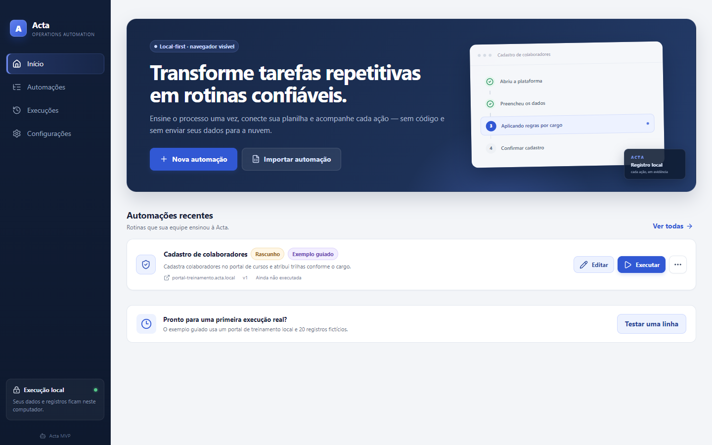

# Acta

[](https://github.com/caoiw/acta/actions/workflows/ci.yml)


Acta é um MVP desktop, local-first, para ensinar e executar processos corporativos no navegador sem escrever código. Ele combina uma timeline visual, dados de CSV/XLSX e um executor determinístico em Microsoft Edge.

O recorte atual é intencional: Windows-first, browser-only, execução visível e foco em cadastros, atualizações e conferências a partir de planilhas.



## O que já funciona

- Dashboard, biblioteca de automações, histórico, relatório e configurações.
- Criação em branco ou por gravação de uma demonstração no navegador.
- Editor vertical com abrir página, clicar, preencher, selecionar, marcar, verificar, condição, espera, pausa assistida e screenshot.
- Importação de CSV e XLSX com validação de cabeçalhos, limite de 25 MB, 50.000 registros e 200 colunas.
- Mapeamento de campos para colunas, valores fixos e credenciais protegidas.
- Teste obrigatório com uma linha antes de liberar execução em lote.
- Pausa, retomada, cancelamento, retry de pendências e relatório por registro.
- Screenshots de erro com campos de formulário mascarados e exportação de relatório em CSV.
- Portal local de demonstração para validar o fluxo completo sem depender de um sistema externo.
- Layout responsivo validado em 1024, 1280 e 1440 px, navegação por teclado e respeito a movimento reduzido.

## Executar o MVP

### Instalador

No Windows 11, baixe o instalador na [release privada v0.1.0](https://github.com/caoiw/acta/releases/tag/v0.1.0). O instalador inclui o runtime; Microsoft Edge precisa estar instalado.

Este build de piloto ainda não possui certificado de assinatura de código. O Windows pode exibir um aviso do SmartScreen. Distribuição corporativa exige assinatura com certificado da organização.

### Desenvolvimento

Requisitos recomendados:

- Windows 11;
- Node.js 22 LTS ou superior;
- Microsoft Edge;
- npm.

```powershell
npm install
npm run electron:install
npm run dev
```

## Primeira jornada

1. Na tela inicial, use **Testar uma linha** no exemplo “Cadastro de colaboradores”.
2. Revise arquivo, domínio, navegador e ações declaradas.
3. Clique em **Iniciar teste**. A Acta abrirá o Edge e o portal local de demonstração.
4. Acompanhe cada passo no runner e abra o relatório ao concluir.
5. Feche e reabra a aplicação para confirmar o histórico local persistido.

Para testar com dados próprios, use [colaboradores.csv](examples/colaboradores.csv) como modelo ou conecte um arquivo CSV/XLSX no editor.

## Comandos de qualidade

| Comando                    | Finalidade                                                                                                      |
| -------------------------- | --------------------------------------------------------------------------------------------------------------- |
| `npm run electron:install` | Instala o runtime Electron fixado no lockfile; é idempotente e obrigatório após um checkout limpo.              |
| `npm run typecheck`        | Verifica os processos main, preload, renderer e tipos compartilhados.                                           |
| `npm run test:unit`        | Executa testes de schema, domínio, fluxo, store criptografado e planilhas.                                      |
| `npm run test:e2e`         | Executa jornadas no Edge, Electron real, responsividade, evidências visuais e pacote Windows quando disponível. |
| `npm run build`            | Gera o build de produção.                                                                                       |
| `npm run package:win`      | Gera o ícone, o executável e o instalador NSIS em `release/`.                                                   |
| `npm audit`                | Confere vulnerabilidades conhecidas das dependências.                                                           |

O gate usado nesta entrega cobre 20 testes unitários e 12 testes E2E, incluindo execução real de uma linha, persistência após reinício e smoke test do `Acta.exe` empacotado.

## Segurança e privacidade

- O renderer roda com `nodeIntegration=false`, `contextIsolation=true`, sandbox, CSP e permissões negadas.
- O IPC valida payloads com schemas estritos e recarrega a rotina persistida antes de executar.
- Definições são declarativas; não há JavaScript, shell ou código arbitrário.
- Tráfego HTTP(S) e WebSocket é limitado aos domínios declarados; Service Workers são bloqueados no perfil de automação.
- Rotinas, planilhas e histórico ficam em um snapshot criptografado pelo `safeStorage` do Electron/Windows.
- Credenciais usam um cofre separado e a interface nunca retorna o valor salvo.
- Exportar uma automação remove as linhas da planilha e invalida aprovações anteriores.
- Evidências só podem ser lidas dentro da pasta do run e possuem limite de tamanho.

Detalhes e responsabilidades do piloto estão em [SECURITY.md](SECURITY.md).

## Limites honestos do MVP

- Apenas Windows e Microsoft Edge/Chrome em modo visível.
- CSV e XLSX; o formato binário legado `.xls` é rejeitado.
- “Descrever o processo” está marcado como **Em breve** e não simula IA inexistente.
- Sem execução agendada, cloud runner, colaboração, SSO, RBAC ou auto-update.
- Sem self-healing automático; mudanças no site devem ser revisadas no editor.
- MFA e CAPTCHA exigem intervenção humana e, quando necessário, um passo de pausa.
- Sites com canvas, componentes sem acessibilidade, múltiplos iframes ou detecção de automação podem exigir ajuste manual.
- CDNs, redirects de autenticação e outros hosts necessários precisam ser declarados explicitamente.
- O instalador de piloto não está assinado digitalmente.

## Estrutura

```text
src/main       Electron, IPC, store criptografado, recorder e runner
src/preload    bridge mínimo e tipado
src/renderer   React, editor, execução e relatórios
src/shared     schemas, tipos e regras determinísticas
tests/unit     regras e persistência
tests/e2e      Edge, Electron, responsividade e pacote Windows
```

O documento [acta-product-principles.md](acta-product-principles.md) registra os princípios de produto usados para manter o MVP simples, local e verificável.
